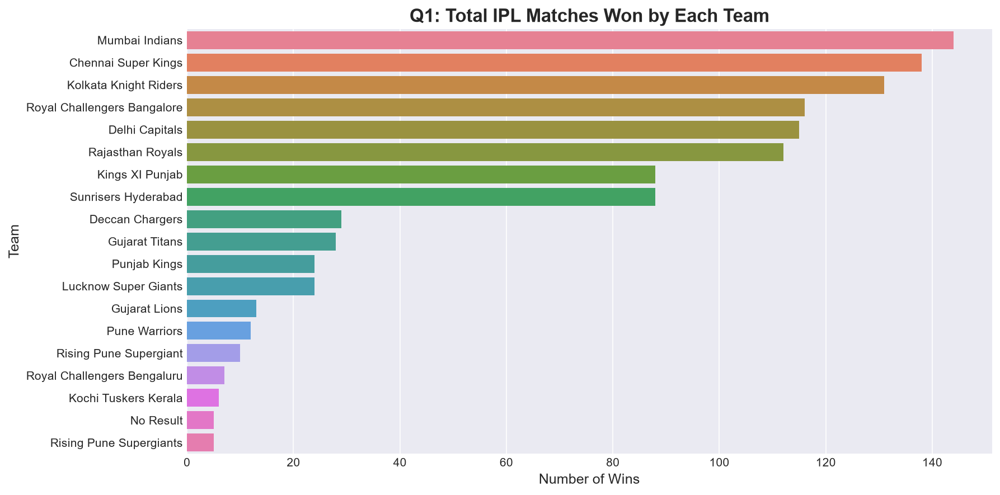
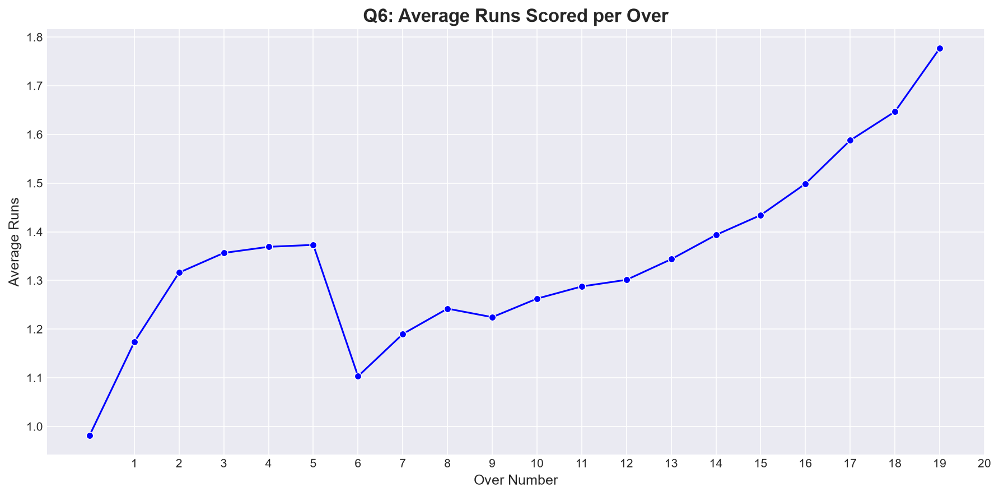
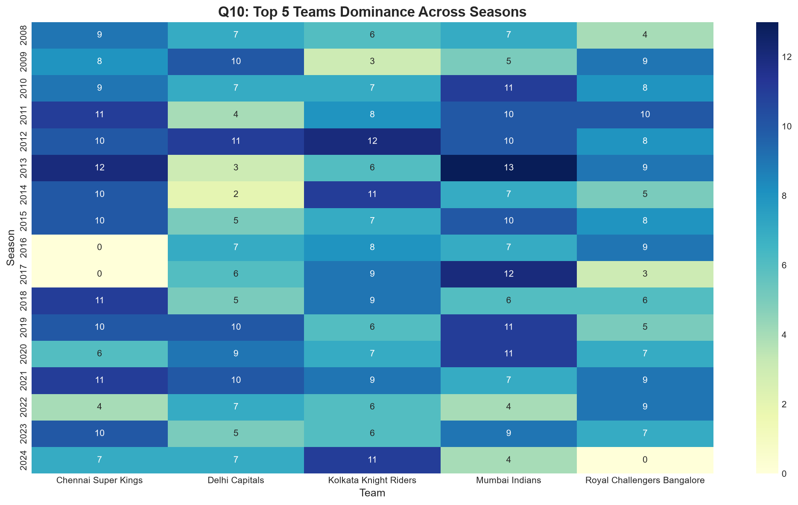

# IPL Data Analysis & Exploratory Dashboard (2008–2020)

An advanced Exploratory Data Analysis (EDA) project analyzing 12+ seasons of Indian Premier League (IPL) cricket history. Using Python, Pandas, Matplotlib, and Seaborn, this project parses through 800+ match records and 260,000+ ball-by-ball deliveries to extract actionable tactical insights.

## 📊 Key Findings & Strategic Insights
* **Team Dominance:** A select group of teams completely control the historical win charts, though names like the Delhi Capitals reflect modern franchise rebrands.
* **The Toss Myth:** Winning the toss provides a minor, surprisingly weak psychological advantage, translating to roughly a 51% match win rate.
* **Venue Dynamics:** Specific high-altitude or short-boundary venues consistently produce higher median total runs, skewing historical match expectations.
* **Batting Advantage:** Teams chasing (batting second) hold a slight historical percentage edge across seasons depending on target size and dew factors.
* **Execution Rates:** The over-by-over line trends visually prove a sharp scoring spike during the Powerplay (overs 1–6) and the Death Overs (overs 16–20), where runs per over max out.

## 🛠️ Tech Stack
* **Language:** Python
* **Data Wrangling:** Pandas, NumPy
* **Data Visualization:** Matplotlib, Seaborn (Styled with `seaborn-v0_8-darkgrid`)

## 📁 Project Structure
* `/data` - Contains `matches.csv` and `deliveries.csv` (Loaded dynamically via relative paths).
* `/notebooks` - Includes `01_eda_exploration.ipynb` containing the data loading, cleaning, and analysis pipeline.
* `/visuals` - Houses exported high-resolution PNG plots for external reporting.

## 🚀 Visualizations Preview
Here is a look at the team victory distribution and season trends generated by the core pipeline:

## ⚙️ Setup Instructions
1. Clone the repository:
   git clone [https://github.com/Nagendraprasad-hub/IPL-Data-Exploratory-Analysis-Dashboard.git](https://github.com/Nagendraprasad-hub/IPL-Data-Exploratory-Analysis-Dashboard.git)